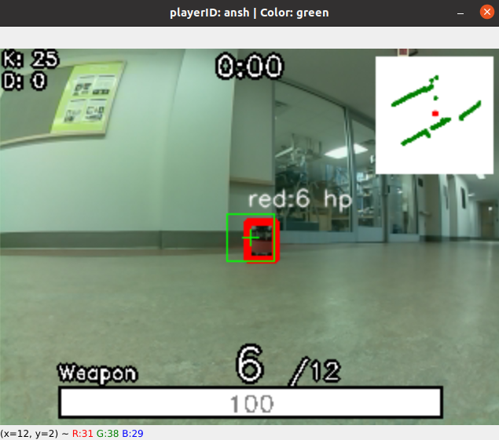

# csro
An augmented reality based robot first person shooter utilising a ROS based messaging architecture. HUD implementation, OpenCV based hit detection, joystick control, unique game-modes and weapon classes.
Add csro to the root package manager of your ROS installation, and follow the steps!



## Steps to run
Assuming an appropriate ROS installation and packaging of the CSRO files
**On the lab machine run:**
```bash
roscd csro

# Copy launch files over to the turtlebot 
# (change XX to be the correct #)
scp -r robot_launch_files/ ubuntu@TURTLEBOT3_XX.union.edu:~/catkin_ws/src/turtlebot3/turtlebot3_bringup/launch 

# rosrun the csro core
rosrun csro csro_core_node.py 
```

**ssh into the turtlebot and run:**
```bash
# PREREQUISITE:
# Point the turtlebot to the master lab machine running roscore

roscd turtlebot3_bringup/launch/robot_launch_files

# Make them executable
chmod +x csro_camera.launch csro_core.launch csro_robot.launch csro_lidar.launch

# Launch the turtlebot nodes with the correct player_id
roslaunch turtlebot3_bringup csro_robot.launch player_id:=<player_id>
```

**Finally, on the lab machine run:**
> *This requires the turtlebot nodes to be running*
```bash
# PREREQUISITE:
# Point the lab machine to the master lab machine instance
# specify the player's color band (player_color:=) and the camera orientation (camera_upsidedown:=)
# Run nodes for the player
roslaunch csro player.launch player_id:=<player_id>

# start game:
rosrun csro start_game.py
```

## Contributors:

- Eric Zhao
- James Heffernan
- Ansh Singhal


